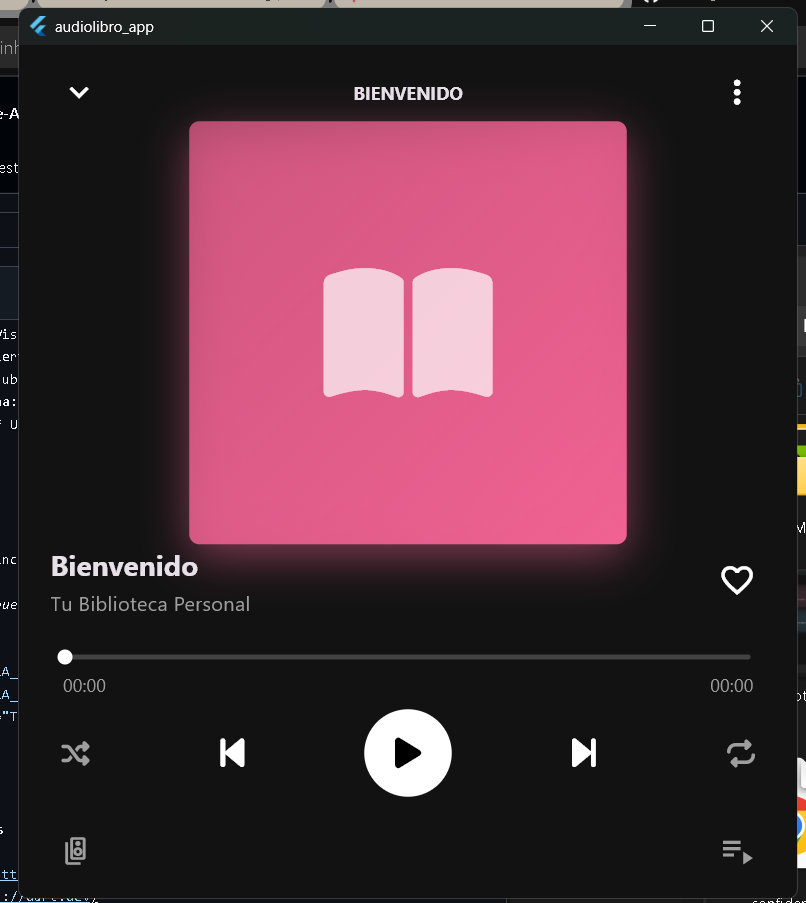
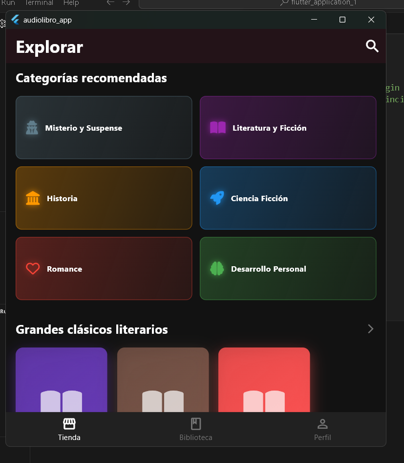
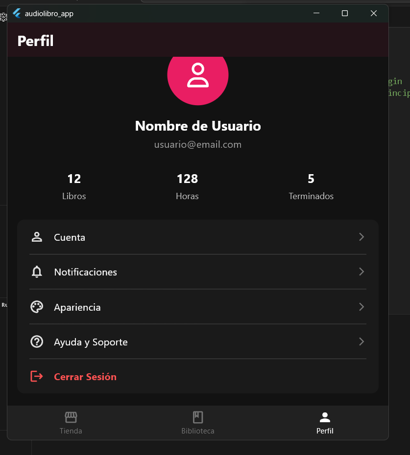

# 📚 ReadWave-APP | Concepto

**Convierte cualquier e-book en un audiolibro personal con el poder de la IA y descubre nuevas historias en nuestra tienda integrada.**

[](https://flutter.dev)
[](https://dart.dev)
[](https://www.figma.com)

---

## 🎯 El Concepto: Tu Biblioteca, Tu Voz

ReadWave es un prototipo de aplicación móvil diseñada para revolucionar la forma en que consumes tus libros. ¿Cansado de esperar que tus títulos favoritos salgan en formato de audiolibro? Con ReadWave, simplemente **subes tu archivo `.epub` y nuestra integración con IA de Google Cloud genera una narración de audio para ti**.

> **Nota Importante:** Este repositorio contiene el **desarrollo del front-end** de la aplicación. Fue creado como una pieza de portafolio para demostrar mis habilidades en el desarrollo de interfaces de usuario (UI) y experiencia de usuario (UX) con Flutter. La lógica del back-end no está implementada.

---

## ✨ Características del Diseño

* **Biblioteca Personal:** Visualiza y gestiona todos los libros que has subido.
* **Narrador con IA:** Convierte tus e-books en audiolibros con voces realistas.
* **Tienda Integrada:** Descubre nuevos libros y adquiere voces premium para personalizar tu experiencia auditiva.
* **Interfaz Limpia y Moderna:** Un diseño intuitivo pensado para una experiencia de usuario fluida y agradable.
* **Reproductor Funcional:** Un diseño de reproductor de audio simple y fácil de usar.

---

## 📸 Vistazo a la App

Aquí puedes ver el flujo principal de la aplicación, incluyendo la nueva sección de la tienda.

*(**Consejo:** ¡Es crucial que reemplaces esto con GIFs o capturas de pantalla de tu app! Muestra la biblioteca, el reproductor y, por supuesto, la tienda.)*

<p align="center">
  
  
  
  
  
</p>

--- 

## 🛠️ Tecnologías Utilizadas

* **Framework:** [Flutter](https://flutter.dev)
* **Lenguaje:** [Dart](https://dart.dev)

---

## 🚀 Próximos Pasos (Visión a Futuro)

Aunque este proyecto es una demostración de front-end, los siguientes pasos para convertirlo en una app completa serían:

1.  **Implementar Back-End:** Desarrollar un servicio (ej. en Firebase Functions o Cloud Run) que reciba el archivo `.epub`.
2.  **Integrar Google Cloud Text-to-Speech:** Conectar el back-end con la API de Google para procesar el texto y generar el audio.
3.  **Desarrollar la Tienda:** Implementar la lógica para comprar voces (usando RevenueCat, por ejemplo) y/o integrar una API de libros.
4.  **Almacenamiento en la Nube:** Guardar los archivos de audio generados en un servicio como Google Cloud Storage.
5.  **Sincronización:** Hacer que la app pueda descargar y reproducir los audios generados.

---

## 👨‍💻 ¿Cómo ejecutar este proyecto?

Si quieres probar el front-end en tu máquina local, sigue estos pasos:

1.  **Clona el repositorio:**
    ```sh
    git clone [https://github.com/GPinheiro93/ReadWave-APP.git](https://github.com/GPinheiro93/ReadWave-APP.git)
    ```
2.  **Navega al directorio:**
    ```sh
    cd ReadWave-APP
    ```
3.  **Instala las dependencias:**
    ```sh
    flutter pub get
    ```
4.  **Ejecuta la aplicación:**
    ```sh
    flutter run
    ```

---

¡Gracias por visitar mi proyecto! Si te gusta la idea o mi trabajo, no dudes en dejar una ⭐️ en el repositorio.

**Gabriel Pinheiro**
* **GitHub:** [@GPinheiro93](https://github.com/GPinheiro93)
